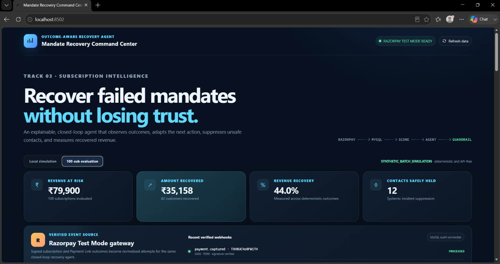

# Mandate Recovery Command Center

### Explainable, closed-loop recovery intelligence for recurring payment failures

An adaptive fintech agent that detects recurring-payment failures, scores mandate health, applies merchant-defined recovery guardrails, suppresses unnecessary customer outreach during systemic incidents, evaluates outcomes, and learns from previous recovery attempts.

> Built for the Razorpay Buildathon using Python, MySQL and Razorpay Test Mode.

---

## Dashboard

---

## What makes it different?

Traditional recovery systems follow fixed rules:

**Payment fails → Send reminder → Retry → Repeat**

Mandate Recovery Command Center uses a closed-loop approach:

**Payment Event → Risk Scoring → Recovery Decision → Guardrails → Action → Outcome → Memory → Next Decision**

The system can distinguish between an individual customer's payment problem and a wider technical incident, preventing unnecessary reminders when failures are likely caused by infrastructure rather than the customer.

---

## Key Results

| Metric | Result |
|---|---:|
| Subscriptions evaluated | 100 |
| Revenue at risk | ₹79,900 |
| Customers recovered | 42 |
| Amount recovered | ₹35,158 |
| Recovery rate | 44% |
| Systemic-failure contacts avoided | 12 |
| Automated test coverage | 40 tests |

> **Note:** Recovery metrics are produced from controlled synthetic/demo scenarios and are intended to evaluate system behaviour, not represent real merchant revenue.

---

## Core Capabilities

- Adaptive mandate-health scoring
- Explainable recovery decisions
- Merchant-configurable policy guardrails
- Systemic payment-incident detection
- Razorpay Test Mode webhook ingestion
- Closed-loop outcome evaluation
- Recovery memory and audit trail
- Counterfactual policy simulation
- Adaptive vs fixed-policy evaluation
- Live monitoring dashboard

---